# aws-s3-static-website-project
AWS S3 static website project covering bucket creation, static website hosting configuration, content upload, public access setup, secure object sharing using presigned URLs, bucket policy security, website updates, and versioning for object recovery.

## 📋 Overview
This project demonstrates how to design, deploy, and manage a static website using Amazon S3. It simulates a real world cloud storage and web hosting workflow by configuring an S3 bucket for static website hosting, uploading website content, enabling public access, and applying security controls.
The project also explores key AWS concepts such as bucket policies, presigned URLs for secure temporary access, object versioning for recovery, and website content updates after deployment.

This project was completed as part of hands on AWS learning to strengthen cloud engineering and DevOps skills.

## ☁️ 🖥️ AWS Services Used
-  Amazon S3 (Simple Storage Service)

## Features Implemented
- S3 bucket creation for static website hosting  
- Static website hosting configuration  
- Uploading website files (HTML, CSS, JS)  
- Public access configuration for website viewing  
- Bucket policy configuration for access control  
- Secure object sharing using presigned URLs  
- Object versioning for file recovery  
- Website content updates and redeployment

## 🛠️  Architecture

This project uses a single Amazon S3 bucket to host a static website.
Users access the site through the S3 static website endpoint after enabling public access to bucket objects.
Website files (HTML, CSS, etc.) are stored directly in the S3 bucket and served as static content without server-side processing.
Access is managed using S3 bucket policies and public access settings. Presigned URLs provide temporary secure access to specific objects, and versioning is enabled to track and recover file changes.

## Steps Performed

### 1. 🪣 S3 Bucket Creation
Created an Amazon S3 bucket called sim-website555 to host the static website. Selected an appropriate region and ensured a unique bucket name.

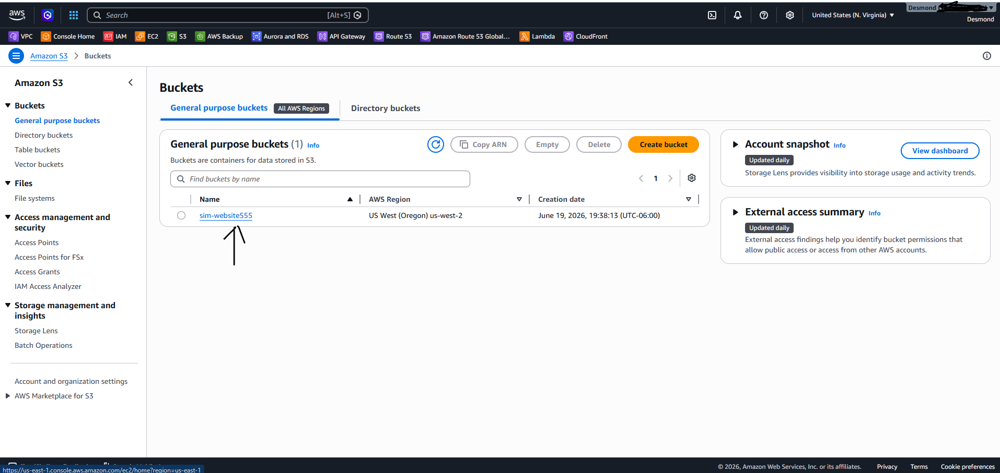

---

### 2. 🌐 Configuring a static website on Amazon S3
Enabled static website hosting on the S3 bucket and configured the index document to serve as the homepage.

   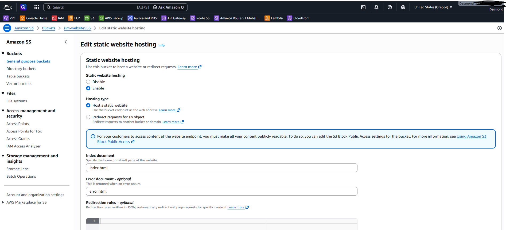
   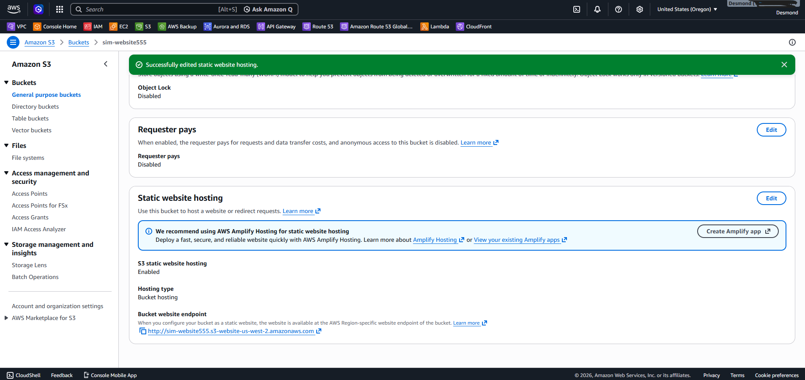

---

### 3. 📤 Website Content Upload
Uploaded website files including HTML, JS and CSS into the S3 bucket and verified successful storage.

   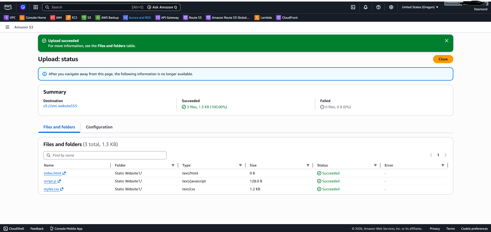

---

### 4. 👁️ Turning on public access to the objects
Updated S3 bucket permissions to allow public access so the website could be viewed via browser.

   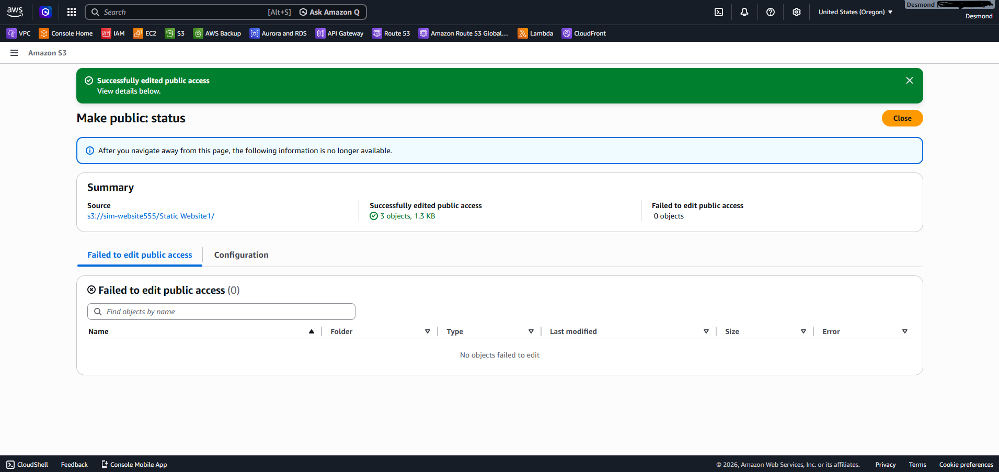
   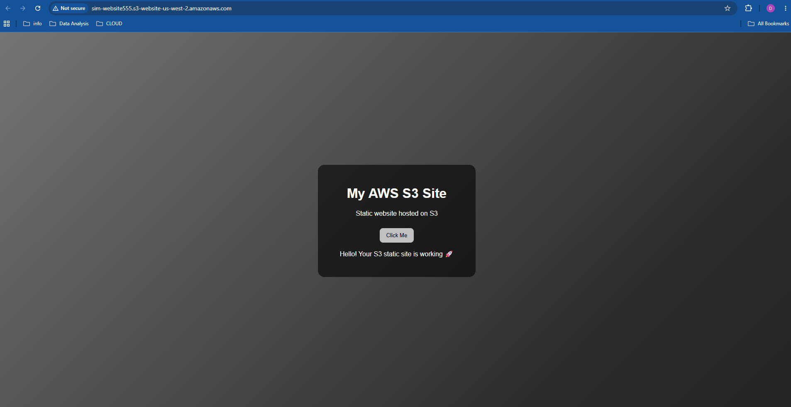

---

### 5.🔗  Presigned URL GenerationBucket Policy Configuration
Generated a presigned URL to securely provide temporary access to a specific object and verified time-based access control.

  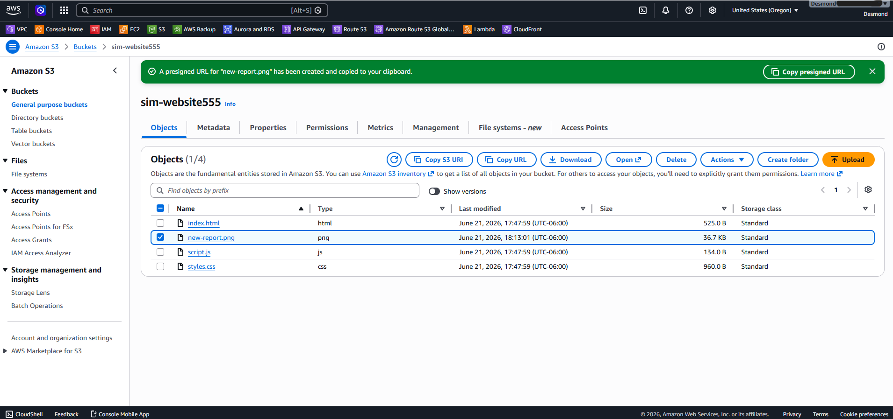

---

### 6. 🛡️  Bucket Policy Configuration
Implemented an Amazon S3 bucket policy to enhance website security by preventing the deletion of critical website files (index.html, styles.css, and script.js). The policy uses an explicit Deny on the s3:DeleteObject action, ensuring that protected website assets cannot be accidentally or maliciously removed.

  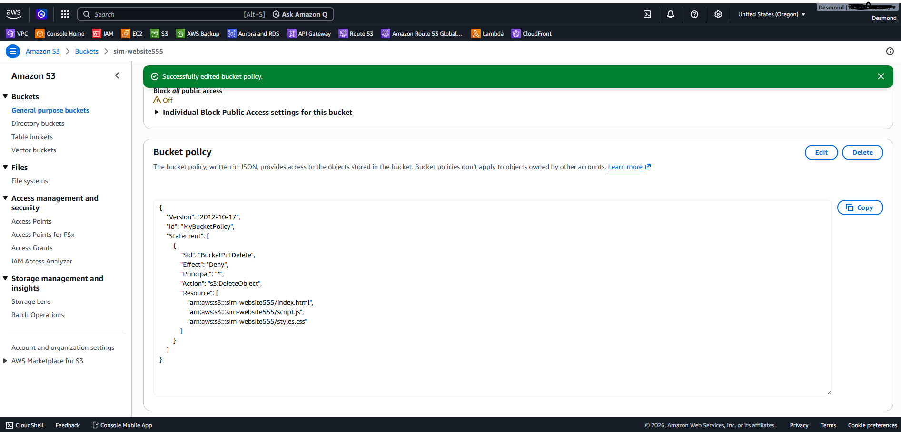
  
   Verified S3 bucket policy blocking file deletion for improved security of static website assets.
   Notice that the index.html file is listed in the Failed to delete pane
   
   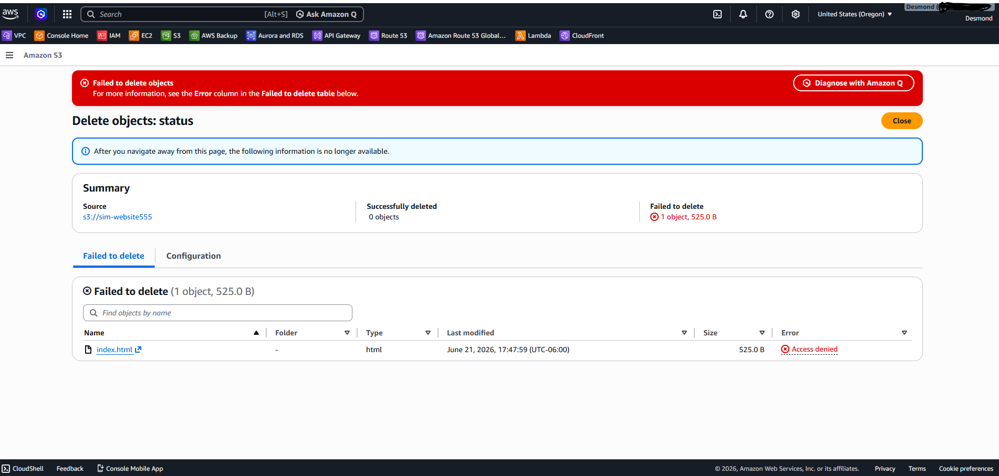
 
 

---

### 7. 🔄 Website Update
Updated website content by modifying and re-uploading files and verified changes on the live site.

   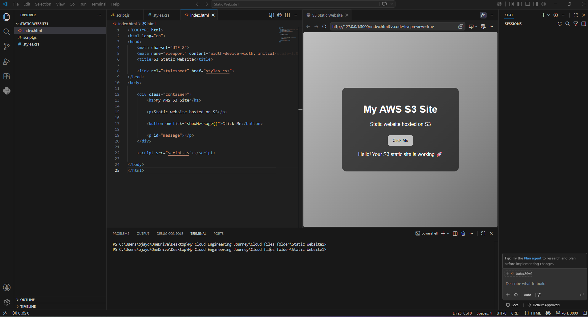

---
### 8. 📋 Object Versioning Enabled
Enabled versioning on the S3 bucket to track changes and allow recovery of previous file versions in case of updates or accidental changes.

   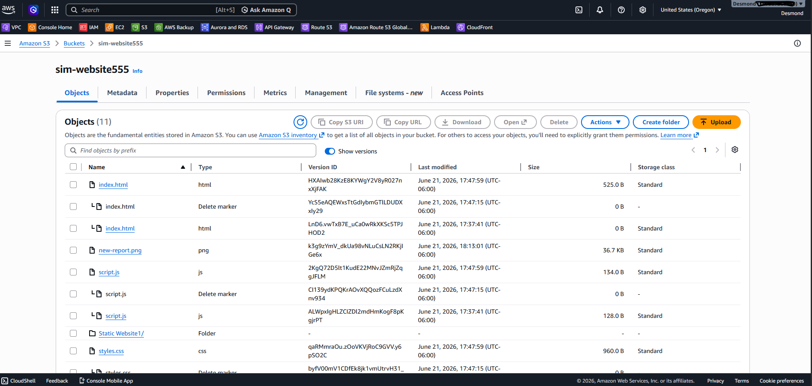

---

## 🔐  Security Highlights

- Public access configured with controlled permissions  
- Bucket policy applied to manage access rules and restrictions  
- Presigned URLs used for secure temporary object sharing  
- Versioning enabled for data recovery and rollback protection  

---

## 🔑 Key Learnings

- How Amazon S3 static website hosting works end to end  
- Difference between public access and secure temporary access  
- Importance of bucket policies in AWS security design  
- How versioning protects against accidental data loss  
- Real world workflow of deploying and updating cloud hosted websites  

---

## ✏️ 🔄 Future Improvements

- Add CloudFront CDN for faster global delivery  
- Connect a custom domain using Route 53  
- Enable HTTPS using AWS Certificate Manager  
- Automate deployment using CI/CD pipelines (GitHub Actions or AWS CodePipeline)  

---

## 🏆 Project Outcome

This project provided hands on experience in deploying a static website on AWS S3 while implementing storage configuration, access control, secure sharing, and version management.

It demonstrates foundational cloud engineering and DevOps skills including infrastructure setup, security awareness, and deployment workflows.

👉 [Click here to view the live site](http://sim-website555.s3-website-us-west-2.amazonaws.com/)
---

## 🔗 Resources

- [AWS S3 Documentation](https://docs.aws.amazon.com/s3/)
- [GitHub Markdown Guide](https://docs.github.com/en/get-started/writing-on-github)

## 📝 Author

- **Desmond Ojei**
- GitHub: [@liquidmetal](https://github.com/liquidmetal)
- Date: 2026-06-19
